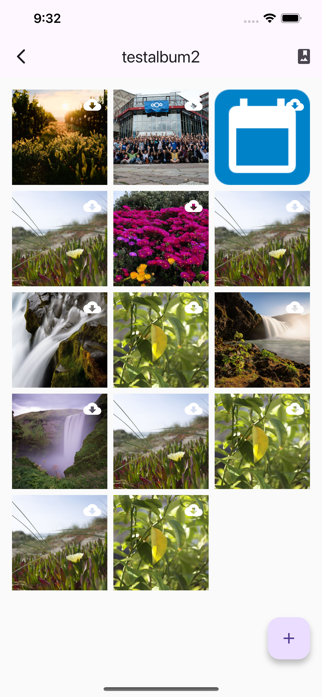

# AlbumBook

A flutter client for uploading and viewing nextcloud memories albums. 

## iOS

### iPhone
||||||||||
|-|-|-|-|-|-|-|-|-|
||||||||||

### iPad
||||||||||
|-|-|-|-|-|-|-|-|-|
||||||||||

## Support

* What is Nextcloud?
  * Nextcloud is a free open source cloud storage software suite can host yourself or use through a provider.
  * Read more at [https://nextcloud.com/](https://nextcloud.com/)
  * Nextcloud's source code is available at [https://github.com/nextcloud](https://github.com/nextcloud)
* What is Memories?
  * Memories is a free open source Nextcloud application designed to manage shared photos within a group of people.
  * Memories is in the Nextcloud App Store [https://apps.nextcloud.com/apps/memories](https://apps.nextcloud.com/apps/memories)
  * Memories' source code is available at [https://github.com/pulsejet/memories](https://github.com/pulsejet/memories)
* Have an Issue?
  * Check if your issue is not already solved at: [https://github.com/MarshallRawson/albumbook/issues](https://github.com/MarshallRawson/albumbook/issues?q=is%3Aissue%20state%3Aclosed)
  * Check if your issue is currently being worked on: [https://github.com/MarshallRawson/albumbook/issues](https://github.com/MarshallRawson/albumbook/issues?q=is%3Aissue%20state%3Aopen)
  * If your issue is not already solved or is not being solved, file a new issue: [https://github.com/MarshallRawson/albumbook/issues/new/choose](https://github.com/MarshallRawson/albumbook/issues/new/choose)
    * Make sure to be respectful, include screen shots, and exhaustively describe your issue.
